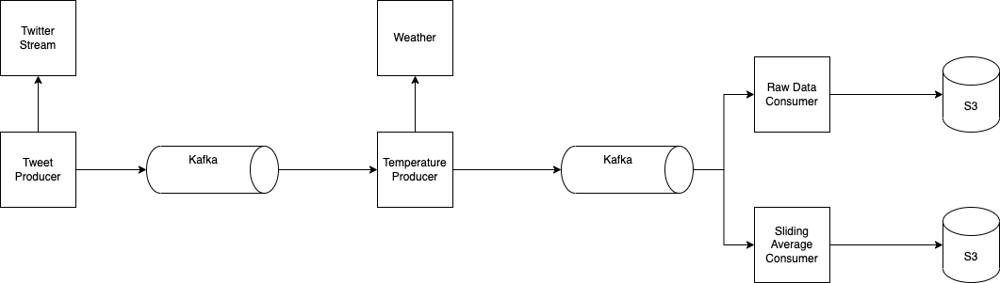

# tweet-weather-pipeline


The data pipeline is implemented in Kotlin using Spring boot and WebFlux.
The entrypoint for the pipeline is in `PipelineRunner` class:
- It is streaming tweets from the Twitter API
- For each tweet with a valid location, it is calling the Weather API to get the current temperature at this location
- `SlidingAverageCalculator` class is used to calculate the sliding average of temperatures
- Both the raw temperature and sliding average are written to output files


## How to start the service?
```bash
# Export environment variables for the API Authentication
export TWITTER_BEARER_TOKEN=${your_token}
export WEATHER_API_KEY=${your_key}

# Start the pipeline
./gradlew bootRun
```

## How to compile and run unit tests?
```bash
# Compile the code and run tests
./gradlew build

# Run test only
./gradlew test
```

## Configuration

Configuration is stored in `application.properties` file:
- The sliding average window size is defined by `temperature.sliding.average.window.size`
- The raw temperature output filename and location is defined by `temperature.output.filename` 
- The sliding average temperature output filename and location is defined by `temperature.sliding.average.output.filename`


## Further Enhancements
- Add error handling and recovery code:
  - retry and timeouts for API calls
  - keep track of invalid tweets or coordinates for troubleshooting
  - backpressure handling, if either Twitter or Weather API is down, or spike in tweets
- Dockerization for easy deployment
- Add more unit tests for end-to-end. Current unit tests only cover small units.


_Note_:
> During my testing, I didn't find any tweets with `Polygon` place type, so I didn't add code for this case.
> Only `Point` and `Feature` place types are handled.
>


## Production Architecture



For production setup (if we were consuming all tweets, not just 1% sample), I would break up the pipeline into separate producers and consumers, and add message queues to decouple the tweet and temperature processing.

Tweet Producer only sends the tweets with valid geo location to the message queue to reduce data amount.

In terms of scalability, the queues can be partitioned and the producers can horizontally scale to handle higher throughput.

Two separate consumers are used for outputting raw temperatures vs. the sliding averages. Output files are stored in s3. 

